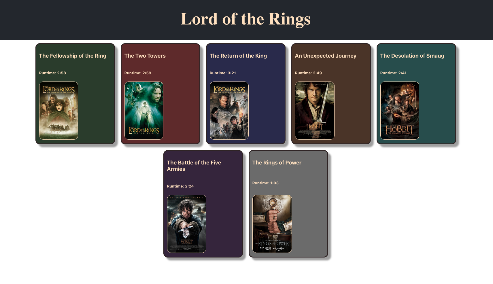

# LORD OF THE RINGS React
building something small to reinforce what I've learned. practice creating components and passing information into them through props. Building a simple website that displays titles, movie posters, and runtime for the original Lord of the Rings Trilogy.

# Getting Started with Create React App

This project was bootstrapped with [Create React App](https://github.com/facebook/create-react-app).

# Objective

1. Pass data through React props into child components
2. Create a reusable component to display data from props
3. creating a Destructuring Props 

# Picture

### Built with
Visual Studio Code - Reactjs 

## website link

Live Site URL: [Add live site URL here]()